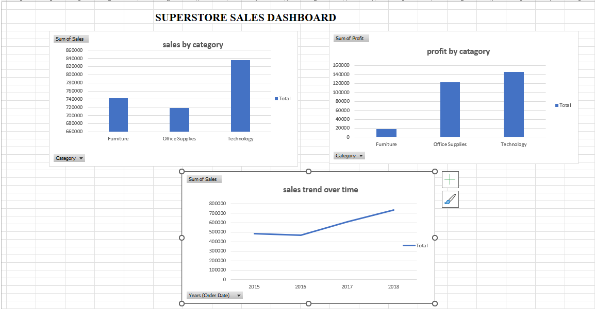
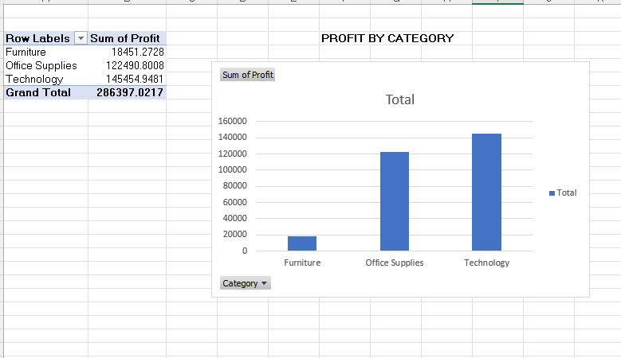
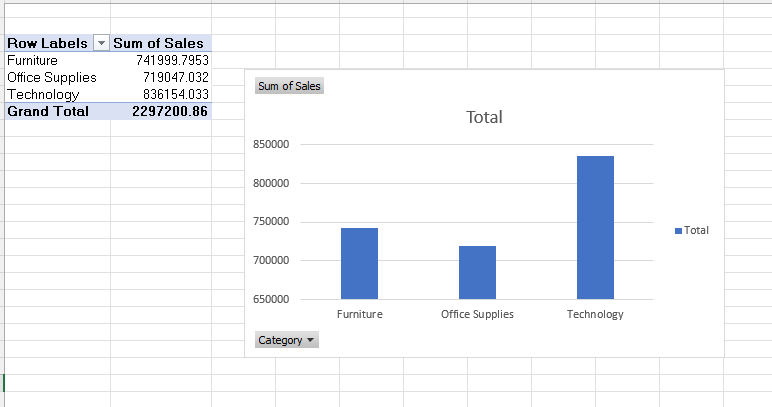
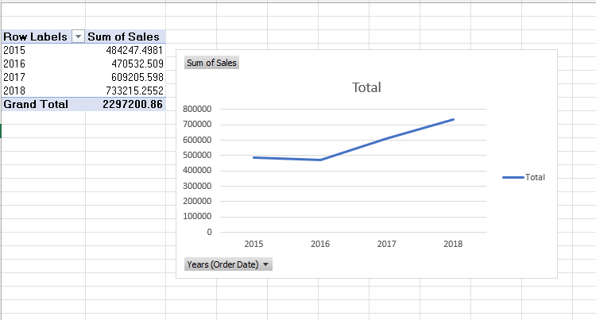

# SCT_DA_1# Task 1 - Sales Dashboard

## Objective
Create an interactive sales dashboard using Excel and the Superstore dataset.

## Tools Used
- Microsoft Excel
- Pivot Tables
- Pivot Charts

## Dashboard

## Visualizations

### Sales by Category

### Profit by Category

### Sales Trend Over Time

## Insights
- Technology has the highest sales.
- Office Supplies and Furniture contribute significantly.
- Sales trend varies over time and can be analyzed monthly.
